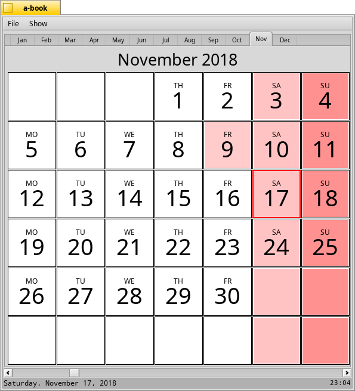
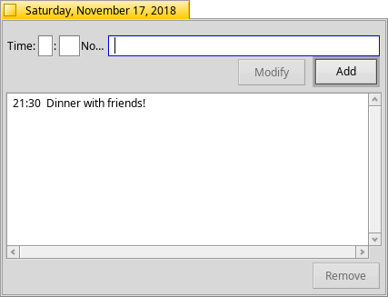
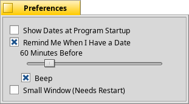

# A-Book

A small calendar application with reminders for Haiku.

## Features

* Create, modify and delete events.
* Get reminders before an event.
* Filter events according to day, month or year.
* Get reminders of an upcoming event on startup.

#### Main Window:

* MenuBar
  * File
    * About: Shows information.
    * Preferences: Opens preferences window.
  * Show
    * This Day's Dates: Shows today's events.
    * This Month's Dates: Shows the month's events.
    * This Year's Dates: Shows the year's events.
    * All Dates: Shows all events.

Right click on a day to add, modify or remove an event of that day.

#### Preferences:

The preferences window can be used to change the settings of A-Book for easier and efficient usage.

